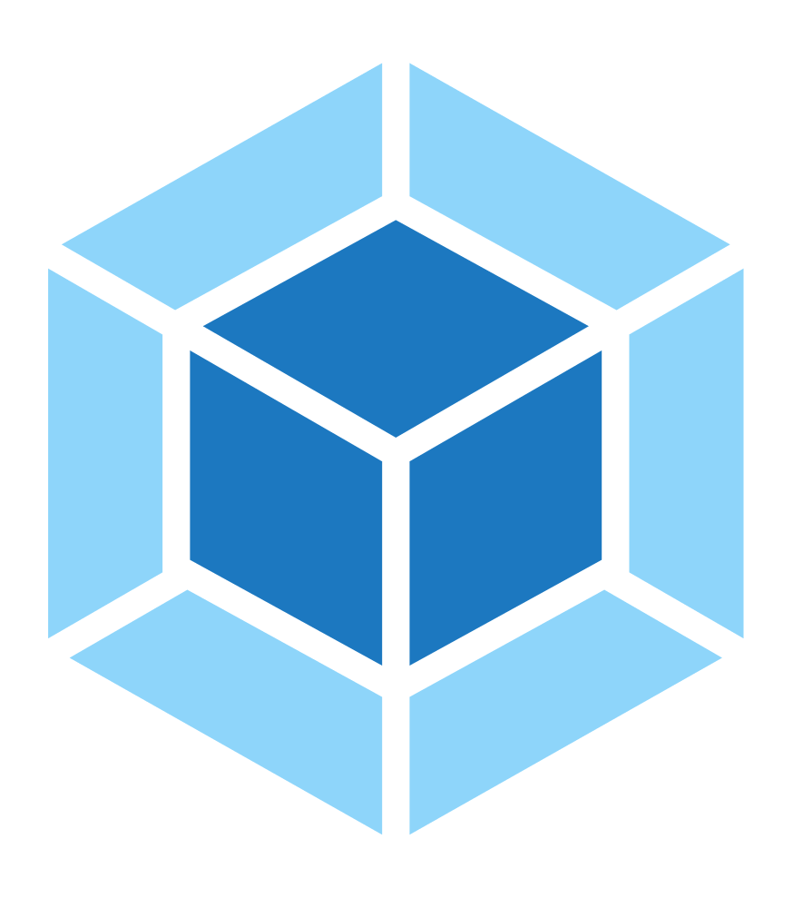

<!-- @format -->

  

<h2 align="center">Hola Amigos ,I'm <a href="https://foushware.netlify.app/">Foush</a></h2>

 <h3 align="center"> 📝 About </h3>

   <samp>
  I'm a Full Stack Web Developer and a Tech Enthusiast who loves everything which involves code💻. I love to explore all fields related to programming.In my free time I like to go to the gym (🏋🏻‍♂️), to watch movies (🎞️) and series (📺), to read books (📚), to listen to music (🎵) .

  </samp>

<h3 align="center"> 🚀 Some Status</h3>

 

<h3 align="center">🔝 Langagues & Technologies</h3>

 

<strong>⌛ This Week</strong> Code Time

 

<h1 align="center">My Skills</h1>

 
<code></code>
<code></code>
<code></code>
<code></code>
<code></code>
<code></code>
<code></code>
<code></code>
<code></code>
<code></code>
<code></code>
<code></code>
<code></code>
<code></code>
<code></code>

 

<h1 align="center">Catch Me At</h1>

 
&nbsp;
&nbsp;

Made with 💖 and ☕

